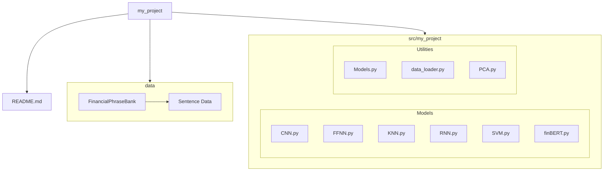

# Sentiment Analysis for Financial Text Data using Machine Learning Methods

This project contains the supporting code for my MMath Project titled 'Sentiment Analysis for Financial Text Data using Machine Learning Methods'. In this project I train and evaluates a range of machine learning classifiers to classify sentences from the Financial Phrasebank by their sentiment.

## Goals of this Project

This project looked at methods to deal with the high-dimensional issues faced when working with NLP. The first problem it solved was the representation issue, where word embeddings were used to represent words in a way that a machine could understand them. Then for classification, this project introduced two dimensionality reduction techniques, PCA and t-SNE, as well as k-NN and SVM as classification techniques. The project then turns to more modern neural network methods, introdcuing FFNNs, CNNs, and RNNs. It compares the performance of all these models with the industry standard FinBERT model. The code in this project enabled fair testing between these methods. Whilst financial sentiment analysis has a multitude of useful applications, this project was focussed on methods of dealing with high-dimensional data. 

## Structure

## Download Requirements

This project uses the Financial Phrasebank as its dataset to evaluate the different classifiers. This can be downloaded from [HuggingFace](https://huggingface.co/datasets/takala/financial_phrasebank). For seemless integration, replace the file Sentence Data, with the datasets.

This project also uses Google's word2vec vectors, with information [here](https://github.com/harmanpreet93/load-word2vec-google).

This project also uses FinBERT, with more information [here](https://huggingface.co/ProsusAI/finbert).
